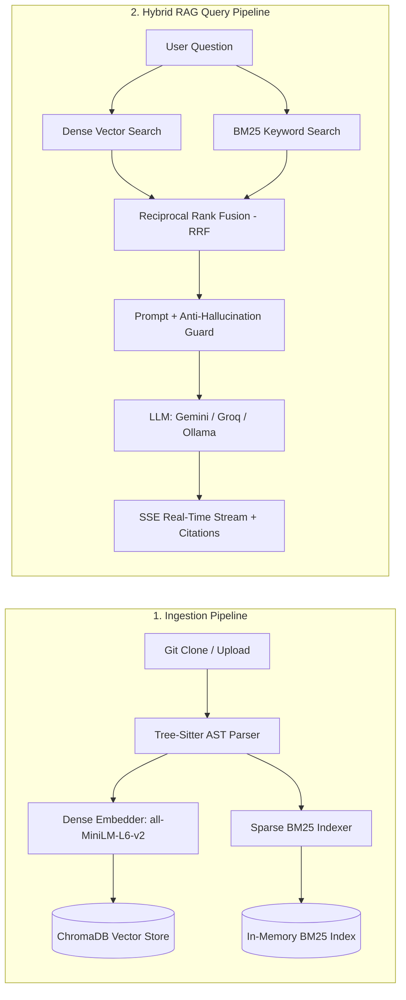

# CodeChat AI - Intelligent Codebase Assistant

Production-Grade RAG-Powered Developer Assistant with Tree-Sitter AST Parsing, Hybrid Dense-Sparse Retrieval, and Verifiable Line Citations.

---

## Live Demo

- Public Web App & Mobile PWA: https://code-chat-ai-steel.vercel.app/
- API Documentation: http://localhost:8000/docs

---

## Overview

CodeChat AI is a developer-first AI assistant that allows engineers to connect any GitHub repository or local codebase and ask natural language questions (for example, "Where is authentication handled?", "Explain the payment webhook flow", or "Find potential memory leaks").

Unlike naive RAG systems that blindly split raw source code every N characters, CodeChat AI uses Tree-Sitter AST parsing to divide code into functional units (functions, classes, methods, interfaces) with exact line number references.

### Core Features

- AST-Aware Semantic Chunking: Analyzes code structure using Tree-Sitter across Python, JavaScript, TypeScript, Go, Java, and C++.
- Hybrid Retrieval (RRF): Dense neural embeddings (`sentence-transformers/all-MiniLM-L6-v2`) and Sparse keyword search (`Rank-BM25`) combined via Reciprocal Rank Fusion.
- Strict Anti-Hallucination Policy: All answers are strictly grounded in retrieved codebase context. If relevant code is not found, the system explicitly states it.
- Exact Line Citations: Clickable citation references (e.g., `[backend/app/auth.py:L15-L42]`) open the exact file and highlight the relevant code block.
- Interactive Architecture Graph: Visual dependency and file relationship explorer powered by ReactFlow.
- RAG Benchmarking Suite: Built-in automated evaluation dashboard measuring Precision@5, Context Recall, Faithfulness, and Retrieval Latency.
- Mobile PWA Support: Standalone Progressive Web App installable on Android, iOS, Windows, and macOS with bottom navigation tabs and offline caching.
- Pluggable LLM Providers: Switch between Google Gemini, Groq (Llama-3), or local Ollama with zero code changes.

---

## System Architecture



---

## Tech Stack

| Layer | Technologies | Purpose |
| :--- | :--- | :--- |
| Frontend | React 18, Vite, Tailwind CSS, Lucide Icons | Responsive UI, modern glassmorphism design, mobile PWA |
| Visualizations | ReactFlow, Prism Syntax Highlighter | Interactive dependency graphs and syntax-highlighted code viewer |
| Backend | Python 3.11, FastAPI, Pydantic v2 | High-concurrency async endpoints, Server-Sent Events (SSE) streaming |
| Code Parsing | Tree-Sitter & GitPython | Syntax-aware AST extraction and Git repository cloning |
| Embeddings | sentence-transformers/all-MiniLM-L6-v2 | Fast, local 384-dimensional vector embedding generation |
| Vector DB | ChromaDB | Embedded persistent vector database |
| Keyword Search | Rank-BM25 | Code-aware tokenization for exact variable and function lookups |
| Database | SQLAlchemy + SQLite / PostgreSQL | User authentication, repository index metadata, chat sessions |
| DevOps & PWA | Docker, Docker Compose, Web App Manifest | Containerized deployment and installable progressive web app |

---

## Quickstart & Local Setup

### Prerequisites

- Node.js >= 18 and npm
- Python >= 3.10
- Git

### 1. Clone the Repository

```bash
git clone https://github.com/your-username/codechat-ai.git
cd codechat-ai
```

### 2. Backend Setup

```bash
cd backend

# Create and activate virtual environment
python -m venv venv
.\venv\Scripts\activate      # Windows (macOS/Linux: source venv/bin/activate)

# Install Python dependencies
pip install -r requirements.txt

# Configure environment variables
cp .env.example .env
# Edit .env and insert your GEMINI_API_KEY (free at https://aistudio.google.com/)

# Run backend test suite
pytest tests/ -v

# Start FastAPI server
uvicorn main:app --host 0.0.0.0 --port 8000 --reload
```

Backend API will be running at: `http://localhost:8000`
Swagger Interactive API docs: `http://localhost:8000/docs`

### 3. Frontend Setup

In a new terminal window:

```bash
cd frontend

# Install Node.js dependencies
npm install

# Start Vite development server
npm run dev
```

Frontend will be running at: `http://localhost:5173`

---

## Mobile Installation Guide (PWA)

CodeChat AI is fully optimized as a Progressive Web App (PWA).

### Android (Chrome / Brave / Edge)

1. Open `https://665fc11da060d4e9-152-59-25-130.serveousercontent.com` in your browser.
2. Tap the "Install Mobile App" button on the screen, or tap the three dots menu in the top right corner.
3. Select "Install app" or "Add to Home screen".
4. The CodeChat AI app icon will be added to your home screen.

### iPhone / iPad (Safari)

1. Open the URL in Safari.
2. Tap the Share button (square icon with an upward arrow) at the bottom.
3. Scroll down and tap "Add to Home Screen".
4. Tap "Add" in the top right corner.

---

## Docker Deployment

To run the entire system with Docker Compose:

```bash
docker-compose up --build
```

- Frontend: `http://localhost`
- Backend API: `http://localhost:8000`

---

## Cloud Deployment Guide

### Backend (Render / Railway / Cloud Run)

1. Push your code to GitHub.
2. Link the repository to Render or Railway.
3. Set the Root Directory to `backend`.
4. Build Command: `pip install -r requirements.txt`
5. Start Command: `uvicorn main:app --host 0.0.0.0 --port $PORT`
6. Set Environment Variables: `GEMINI_API_KEY`, `SECRET_KEY`, `LLM_PROVIDER=gemini`.

### Frontend (Vercel / Netlify / Cloudflare Pages)

1. Link the repository to Vercel.
2. Set the Root Directory to `frontend`.
3. Build Command: `npm run build`
4. Output Directory: `dist`
5. Set Environment Variable: `VITE_API_URL=https://your-backend-domain.com/api`
6. Deploy.

---

## Testing & Quality Assurance

Run the automated backend test suite:

```bash
cd backend
pytest tests/ -v
```

To run retrieval benchmarks in the application:

1. Log into CodeChat AI and navigate to the "Benchmarks" tab.
2. Click "Run Retrieval Benchmark".
3. View real-time metrics including Precision@5, Mean Reciprocal Rank (MRR), Context Recall, and Latency in milliseconds.

---

## License & Author

MIT License. Designed and developed by Saurabh.
